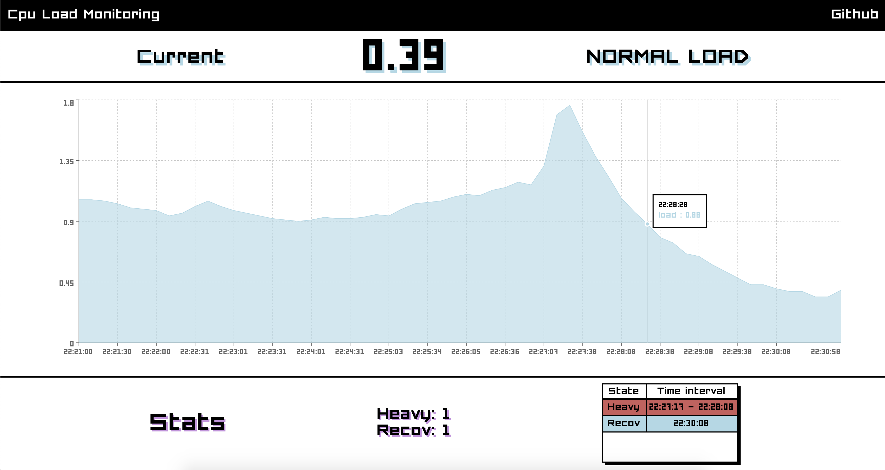
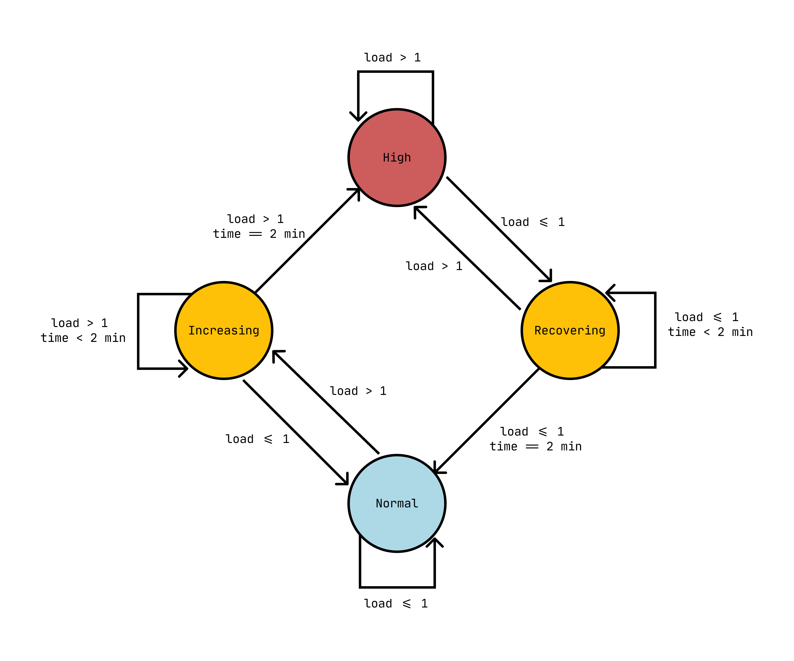

# CPU Load Monitoring web app



## Description

This web application is organized using `yarn workspaces` and is constitued of 2 packages:

-   `client`, containing the web application source code of the CPU Load Monitor interface, realised mostly with React styled-components and recharts (for the area chart).
-   `server`, containing a very lightweight and simple web server, realised in NestJS. It returns the average CPU load upon `GET http://<SERVER_HOST>:<SERVER_PORT>/api/cpu/load` requests. It also serves statically the `client` app when it has been compiled (there is a static middleware to differentiate API calls from static hosting calls).

## Quickstart

### With yarn/npm commands

When at the root of the repository:

```bash
yarn install
yarn build
yarn deploy

# Or using make
make deploy
```

The application should be available at `http://localhost:3000`

NB: ⚠ There is also a **demo mode**, where the server send a pre-determined sequence of CPU loads and loops forever on them. This is for testing and demonstration purposes and can be ran by using `yarn demo` instead of `yarn deploy`. Under the hood, this is an env variable which is in charge of enabling this mode: `yarn demo` === `MODE=DEMO yarn deploy`.

### With docker pull

A pre-compiled image should be available on Dockerhub:

```bash
# Pull image from repository
docker pull epsxy/cpu-load-monitor:latest

# Run
docker run --name cpu-load-monitor -d  -p 80:3000 -t epsxy/cpu-load-monitor:latest

# Stop
docker stop cpu-load-monitor

# Remove container
docker rm cpu-load-monitor
```

After launching the run command, the server should start and the app should be available to `http://localhost:80`.

### With docker build

When at the root of the repository, you can build & run the app using Docker:

```bash
# build
docker-compose build

# run with logs
docker-compose up

# run
docker-compose up -d

# stop
docker-compose down
```

The app will be available at `http://localhost:80`.

NB: As it's running from inside a container, the CPU load average will be different from the one on your host. I often get `0.02`load values inside the container when I have `0.2` in my host.

## Improvements

A lot of stuff could be done to improve the app:

-   Make all the input constants customizable. Right now the default is 10 minute history, data fetch every 10 seconds, CPU high threshold equals 1 and streak (time after which we consider high state or recovered event) is 2 minutes. All of them could be freely choosen on the interface by the user.
-   Avoid polling HTTP requests and start using a websocket to send data from the server to the client.
-   Monitor serveral CPU cores at the same time, or provide an overview of per-core load values (smaller graphs, one per core ?).
-   Use the browser [Notification](https://developer.mozilla.org/en-US/docs/Web/API/notification) API to send notification to the user even if they are not looking at the screen or not looking at the tab itself.
-   Color the parts of the graph differently dependending on the load, for example blue for the "NORMAL" parts of the graph, then orange for the "INCREASING/RECOVERING" and red for the "HIGH" part.
-   Mobile accessibility. Even if the app is right now quite responsive as there are some media queries for screens below 700px, this could be improved a lot.

## Implementation

The goal of this application was rougthly to:

-   Monitor the current CPU average load value.
-   Update the CPU average load value every 10s.
-   Indicate if the CPU is under a high load.
-   Keep a 10 minutes history of all the retrieved load values
-   Be able to detect `high CPU loads` (LoadAVG > 1 during 2 minutes)
-   Be able to detect `recover` events (LoadAVG <= 1 during 2 minutes, after a high CPU load state)
-   Keep an history of previous `high loads` states and `recovered` events.

My implementation relies on the following principle:



The application state is one state between NORMAL, INCREASING, HIGH, or RECOVERING, with the following rules:

-   When the application starts, we look at the first CPU value. If it's > 1, we are in `INCREASING` state, otherwise in `NORMAL` state.
-   Then, we compute the next state each time a value is received, using the algorithm represented by the image.

In short:

```
1. if received value > 1
    a. if previous state === HIGH, we stay HIGH
    b. if previous state === INCREASING, we look at the previous values. If it's been 2 min that there is an INCREASING state (i.e. the last 11 values are INCREASING), the new state is HIGH.
    c. if previous state === NORMAL, we go to INCREASING.
    d. if previous state === RECOVERING, we go to HIGH.

2. if received value <= 1
    a. if previous state === HIGH, we go to RECOVERING
    b. if previous state === INCREASING, we go to NORMAL
    c. if previous state === NORMAL, we stay NORMAL.
    d. if previous state === RECOVERING, we look at the previous values. If it's been 2 min that there is an RECOVERING state (i.e. the last 11 values are RECOVERING), the new state is NORMAL.
```

The high load and recover definition made me introduce the 2 intermediate states `INCREASING` and `RECOVERING`. I decided to keep them in the interface because they introduce a smoother transition between `NORMAL` and `HIGH` states. The application has to stay for 2 minutes during theses states to transition to the other state (`INCREASING -> HIGH` transition and `RECOVERING -> NORMAL` transition).

Indeed, depending of the state of the app, the color changes. It's blue for `NORMAL`, red for `HIGH` and orange for the transitional states `INCREASING` and `RECOVERING`.

When we have an `INCREASING -> HIGH` transition, we display a notification in the top right, saying that the CPU is under high load. On the opposite, when we have an `RECOVERING -> NORMAL` transition, this means 2 minutes have occured since the last value greater than 1 received, and a `Recovered` notification is displayed on the top right. These notifications have the same color scheme than `HIGH` and `NORMAL` states respectively.

## Functionalities

-   Display current average CPU load value
-   Display current state of the CPU (NORMAL LOAD, INCREASING LOAD, HIGH LOAD, RECOVERING LOAD)
-   Display a 10 minutes history window of all the values, displayed as an area chart.
-   When the app starts, there is no value yet in the app and then we make requests every 10 seconds so the application will fill little by little during the first 10 minutes. After that, the history disappear one value at the time (the oldest one is erased).
-   Display a visual alert at the user when an high load state is detected (red notification on top right of the screen)
-   Display a visual alert at the user when a recovered event is detected (blue notification on top right of the screen)
-   Diplay number of high loads states
-   Display number of recovered events registered
-   Display a scrollable table of past `High` and `Recovered` events, with the moment it occured.
-   The app has been tested (using [Color Oracle](https://colororacle.org/)) for accessibility regarding all the color choice. Even if the information is accessible by reading the text, the colors have been choosen to be distinguishable by color blind people. That's the reason why we choose `blue` instead of `green` for the state colors.

## Development

1. Start the server `yarn workspace server run start`. It will listen on `:3000` port
2. Start the client in dev mode `yarn workspace client run start`. The client will start on another port, `3001` for example (because server already uses `3000` port). The app in dev mode will **always** make HTTP requests for CPU Load at `http://localhost:3000/api/cpu/load`. Meaning the server must be running and listening always at this port.
3. In production, the app is looking at `window.location.port` value.

## Running tests

At the root:

```bash
make test

# or with coverage
make test-cov
```

## File Structure

### Client

```bash
src
.
├── App.test.tsx
├── App.tsx
├── components
├── constants
├── fonts
├── helpers
├── index.css
├── index.tsx
├── model
├── react-app-env.d.ts
├── reportWebVitals.ts
└── setupTests.ts
```

-   `components`: contains the React components.
-   `constants`: containts all the input constants of the app (history time length, cpu load threshold, etc).
-   `fonts`: contains the Forced Square font. Licenced under a Creative Commons Licence. Credits to [Paul Ijsendoorn](https://drawperfect.com/free-download-forced-square-techno-font/).
-   `helpers`: contains helper function to format and compute data in the components. They are standalone for easier testing.
-   `model`: models used throught all the files for typescript type annotations.

### Server

```bash
src
.
├── app.controller.spec.ts
├── app.controller.ts
├── app.module.ts
├── controllers
│   ├── cpu.controller.spec.ts
│   └── cpu.controller.ts
├── main.ts
└── middlewares
    └── static.middleware.ts
```

# Credits

-   [Paul Ijsendoorn](https://twitter.com/pijsendoorn), creator of “Forced Square” font.
